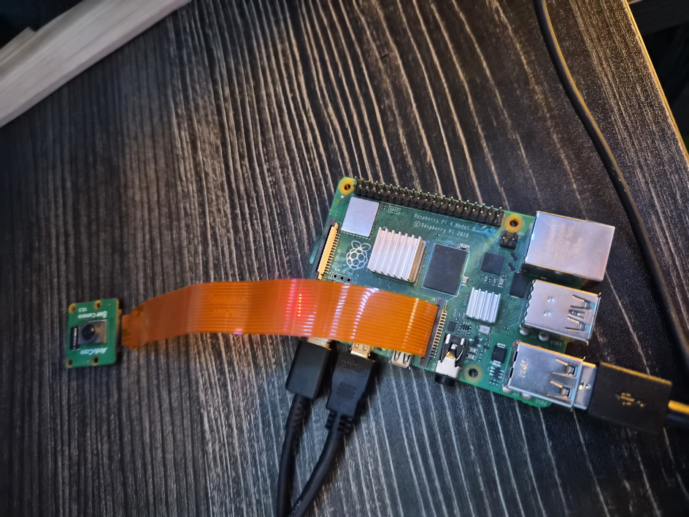
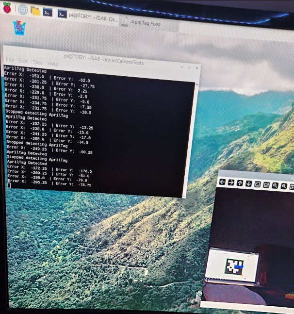
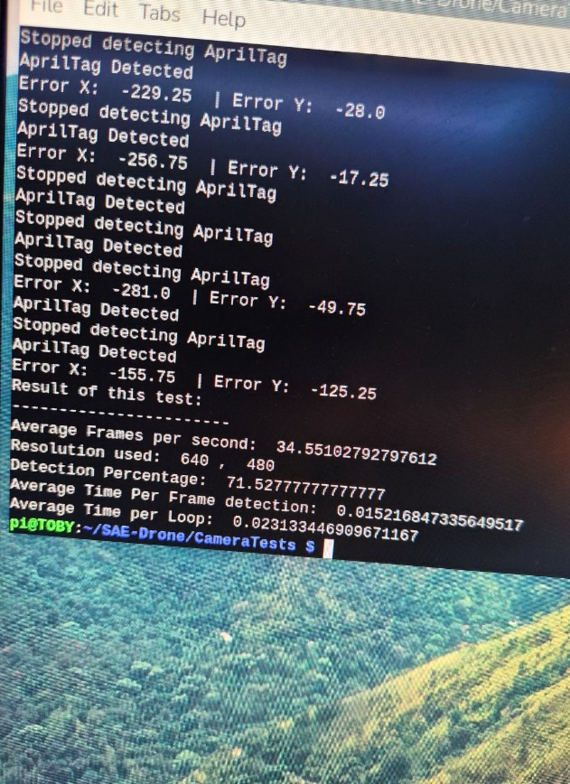

# UAV AprilTag Tracking

Real-time AprilTag detection and pixel-space target alignment developed on a Raspberry Pi for UAV visual guidance experiments.

The system uses a Raspberry Pi camera, Picamera2, and OpenCV to detect an AprilTag target, estimate its center in image coordinates, and calculate horizontal and vertical alignment error relative to the camera frame.

This project was developed as part of UAV integration and autonomous landing experimentation for SAE Aero Design.

## Hardware Setup



Raspberry Pi and camera setup used for onboard AprilTag processing.

## Live Detection



The vision pipeline detects the AprilTag in real time and computes its center relative to the camera frame.

For a 640 × 480 image, the camera center is:

```text
(320, 240)
```

The detected tag center is calculated from the average position of its four corners. The resulting alignment error is reported as:

```text
error_x = tag_x - CenterX
error_y = CenterY - tag_y
```

These values represent the target offset from the center of the camera image and can later be used to command lateral corrections during UAV alignment.

## Performance Benchmark



The detection pipeline was benchmarked at a resolution of 640 × 480 to evaluate real-time performance.

Example results:

* Average frame rate: **34.6 FPS**
* Detection percentage: **71.5%**
* Average detection time per frame: **15.2 ms**
* Average full-loop time: **23.1 ms**

The detection percentage represents the fraction of processed frames in which the AprilTag was successfully identified during the test interval.

The benchmark separates AprilTag detection time from the total loop time to estimate the processing overhead introduced by camera capture, visualization, and program execution.
